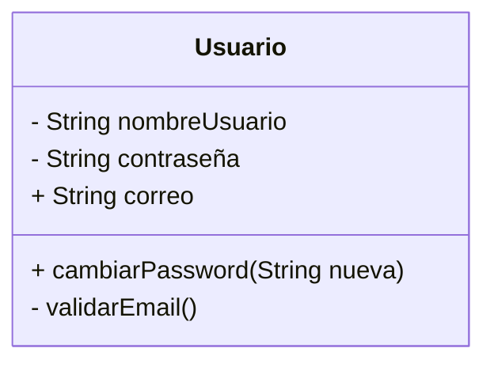
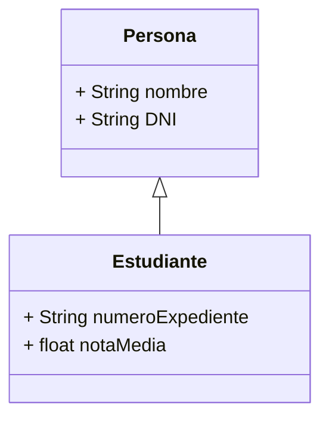
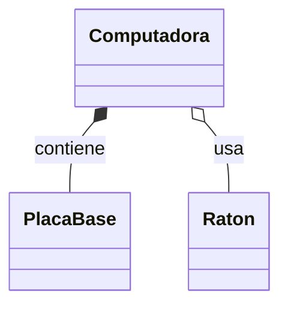
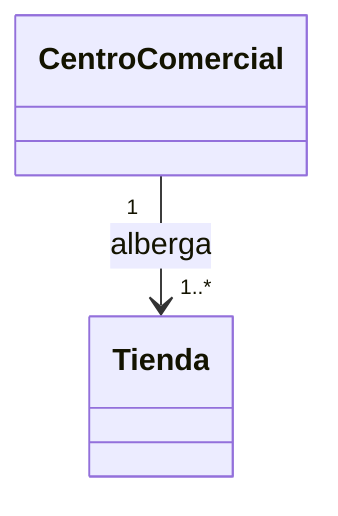
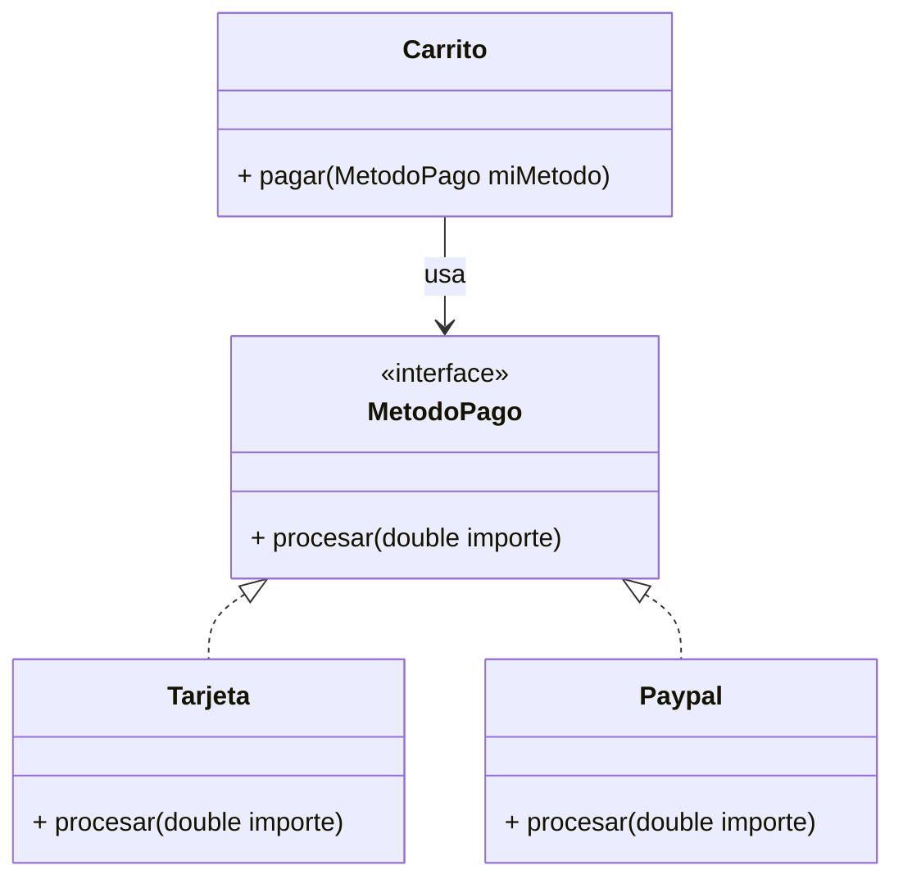
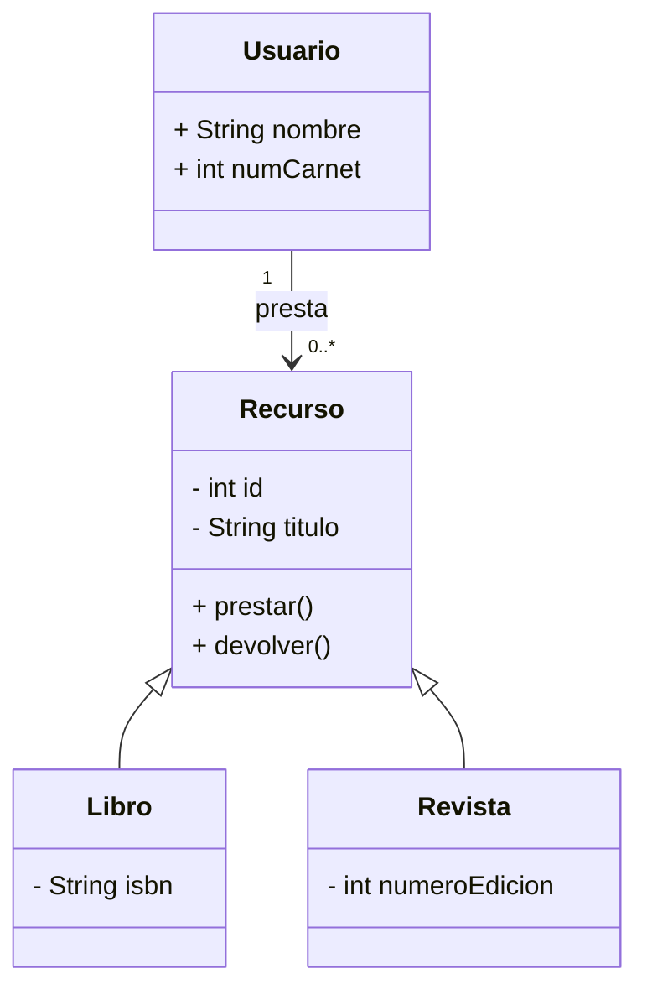

# 6.2.Bateria de ejercicios

Ejercicio 1

```mermaid
classDiagram
    class Usuario {
        - String nombreUsuario
        - String contraseña
        + String correo
        + cambiarPassword(String nueva)
        - validarEmail()
    }
```

Ejercicio 2

```mermaid
classDiagram
    class Persona {
        + String nombre
        + String DNI
    }

    class Estudiante {
        + String numeroExpediente
        + float notaMedia
    }

    Persona <|-- Estudiante
```

Ejercicio 3

```mermaid
classDiagram
    class Computadora
    class PlacaBase
    class Raton

    %% Composición (vínculo fuerte)
    Computadora *-- PlacaBase : contiene

    %% Agregación (vínculo débil)
    Computadora o-- Raton : usa
```

Ejercicio 4

```mermaid
classDiagram
    class CentroComercial
    class Tienda

    CentroComercial "1" --> "1..*" Tienda : alberga
```

Ejercicio 5

```mermaid
classDiagram
    class MetodoPago {
        <<interface>>
        + procesar(double importe)
    }

    class Tarjeta {
        + procesar(double importe)
    }

    class Paypal {
        + procesar(double importe)
    }

    class Carrito {
        + pagar(MetodoPago miMetodo)
    }

    MetodoPago <|.. Tarjeta
    MetodoPago <|.. Paypal

    Carrito --> MetodoPago : usa
```

Ejercicio 6

```mermaid
classDiagram
    class Recurso {
        - int id
        - String titulo
        + prestar()
        + devolver()
    }

    class Libro {
        - String isbn
    }

    class Revista {
        - int numeroEdicion
    }

    class Usuario {
        + String nombre
        + int numCarnet
    }

    Recurso <|-- Libro
    Recurso <|-- Revista

    Usuario "1" --> "0..*" Recurso : presta
```
